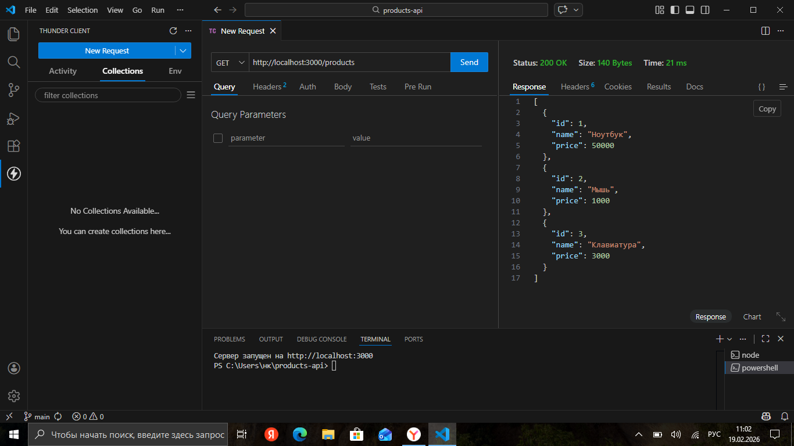
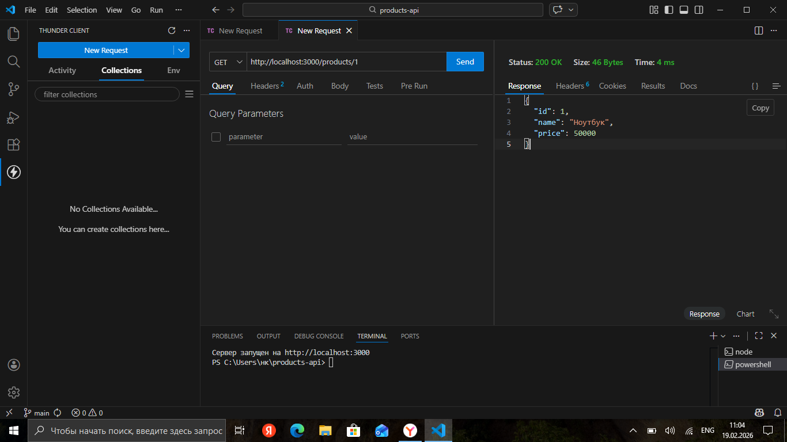
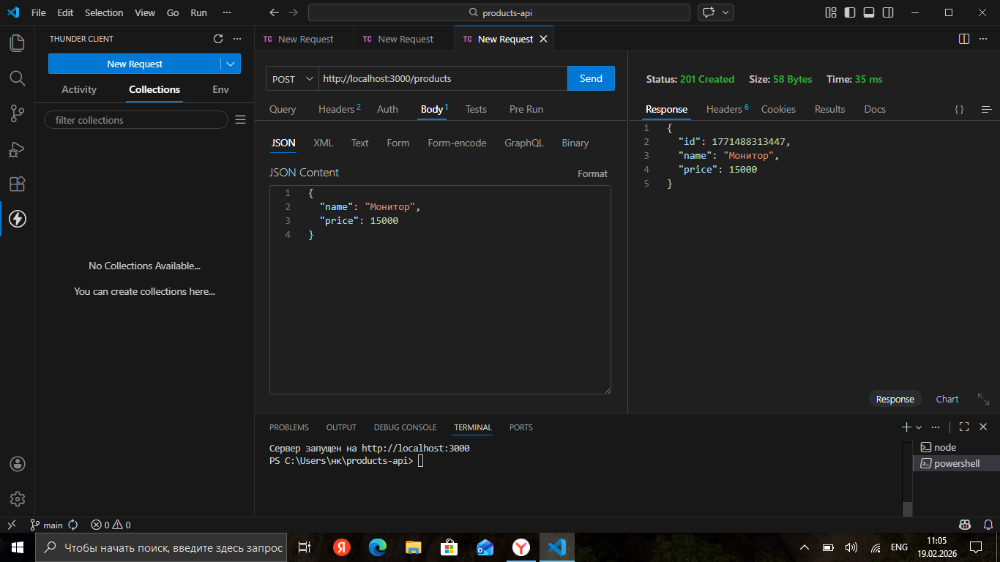
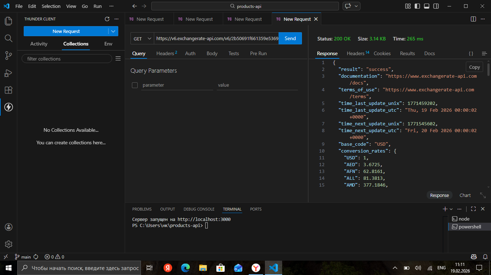
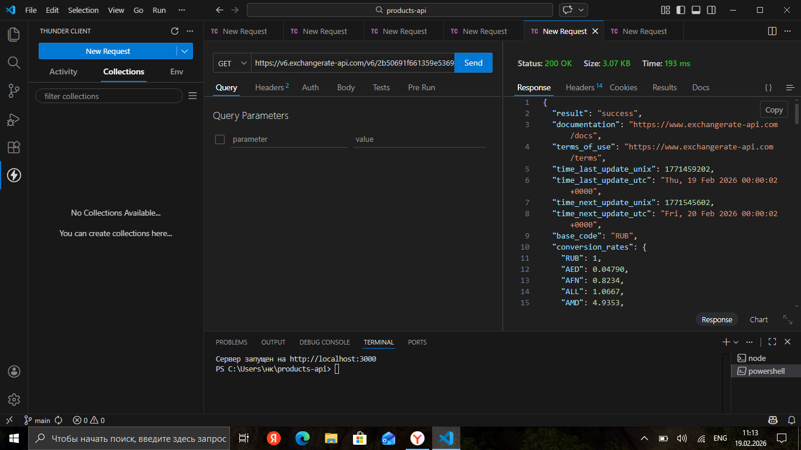
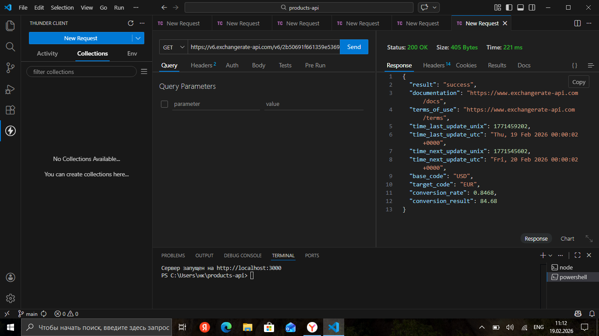
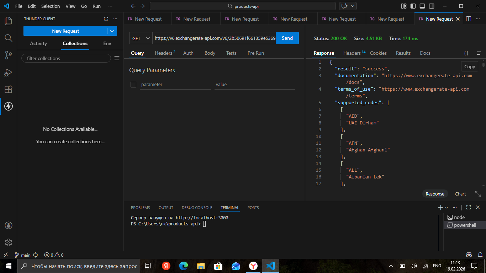
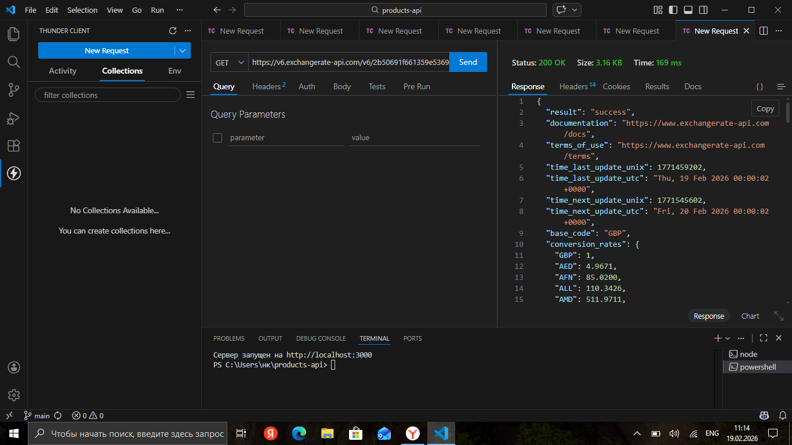

# Практическое занятие №3: JSON и внешние API

## Часть 1: Тестирование своего API в Thunder Client

### Запрос 1: GET /products (получить все товары)

### Запрос 2: GET /products/1 (получить товар по ID)

### Запрос 3: POST /products (создать товар)

## Часть 2: Работа с внешним API (ExchangeRate-API)

### Запрос 1: Курсы валют относительно USD

### Запрос 2: Курсы валют относительно RUB

### Запрос 3: Конвертация USD→EUR

### Запрос 4: Список всех поддерживаемых валют

### Запрос 5: Курсы валют относительно GBP

## Вывод
В ходе выполнения практического занятия:
- Научился тестировать API через Thunder Client
- Изучил структуру JSON-ответов
- Получил опыт работы с внешними API
- Освоил отправку GET и POST запросов
- Изучил работу с API курсов валют ExchangeRate-API
